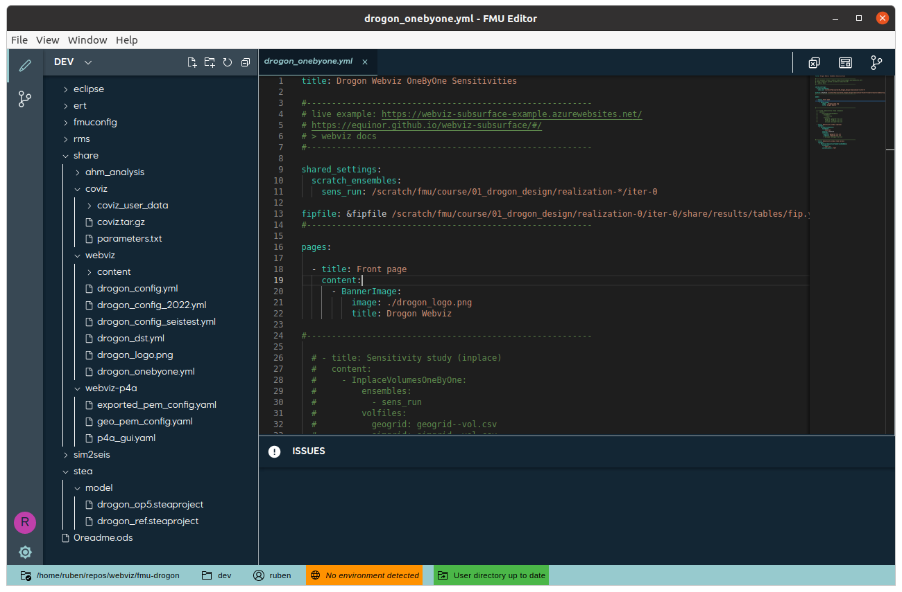

> ⚠️ Please note that this is a beta version.

<h1 align="center"> FMU Editor </h1> <br>

<p align="center">
  
</p>

<p align="center">
  An integrated development environment for FMU users.
</p>

## Table of Contents

-   [Introduction](#introduction)
-   [Features](#features)
-   [Feedback](#feedback)
-   [Build Process](#build-process)

## Introduction


[](https://lgtm.com/projects/g/equinor/fmu-editor/alerts/)
[](https://lgtm.com/projects/g/equinor/fmu-editor/context:javascript)
[](https://github.com/prettier/prettier)


Enhance your work with FMU by using this integrated development environment. Benefit from its schema validation, supportive editor environment and its source control capabilities.

Available via Komodo.

<p align="center">
  
</p>

## Features

- Integrated file explorer
- Editor for editing FMU configuration files
  - Connected to Komodo for automatic JSON schema support
  - Preview of config files
- Integrated file version control system
  - Pull, push and log changes
  - Resolve conflicts
  - View other users' changes
- Changelog explorer for comparing file changes

## Feedback

Feel free to send us feedback in the 💬 [discussions forum](https://github.com/equinor/fmu-editor/discussions) or ❗[file an issue](https://github.com/equinor/fmu-editor/issues).

Feature requests are always welcome 😊👍. If you'd like to contribute, please take a look at our 📜 [guidelines](https://github.com/equinor/fmu-editor/blob/master/doc/CONTRIBUTE.md).

## Build Process

1. Install Node.js >= 18.13.0 (https://nodejs.org/en/ or for Node Version Manager https://github.com/nvm-sh/nvm).
2. Install dependencies:
    ```bash
    npm install
    ```
3. Start electron app in developer mode:
    ```bash
    npm run electron:dev
    ```
4. In order to test the production-ready app, run:
    ```bash
    npm run electron:build
    ```
